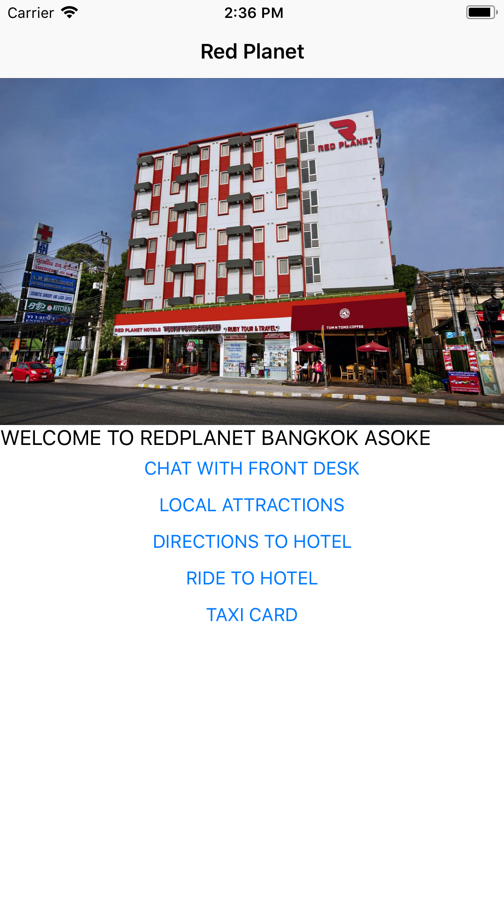
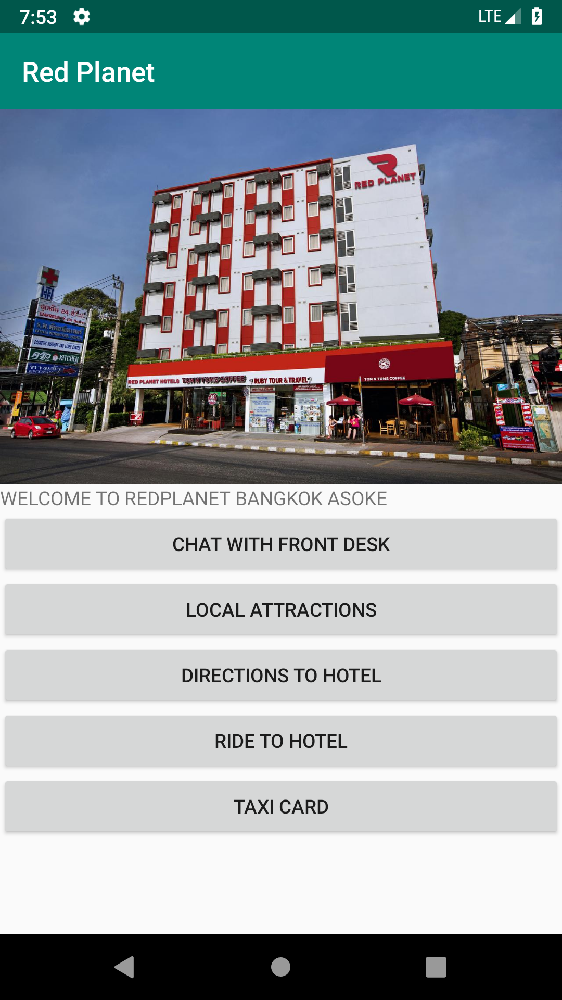

# JSON App Notation

## Introduction

JSON App Notation defines structural format for app and its components. There are largely three parts in it, element, style and action.

iOS | Android
--- | ---
 | 

## Data Format

JSON App Notation parser parse data with following format.

```
{
  "structure": ElementData,
  "style": [Style]
}
```

## Element

### Element Data

All element has following format.

```
{
  "type": ElementType,
  "data": {
    "elementId": String,
    "class": [String]
  }
}
```

### Element Type

- label
- image
- textButton
- imageButton
- container
- list
- textTitleBar
- imageTitleBar
- screen
- navigation

### Label Element

Represent label.

```
{
  "type": label,
  "data": {
    "elementId": String,
    "class": [String],
    "text": String
  }
}
```

### Image Element

Represent image.

```
{
  "type": image,
  "data": {
    "elementId": String,
    "class": [String],
    "source": URL
  }
}
```

### Text Button Element

Represent text button.

```
{
  "type": textButton,
  "data": {
    "elementId": String,
    "class": [String],
    "text": String
  }
}
```

### Image Button Element

Represent image button.

```
{
  "type": imageButton,
  "data": {
    "elementId": String,
    "class": [String],
    "source": URL
  }
}
```

### Container Element

Represent container.

```
{
  "type": container,
  "data": {
    "elementId": String,
    "class": [String],
    "elements": [Element]
  }
}
```

### Text Title Bar Element

Represent text title bar.

```
{
  "type": textTitleBar,
  "data": {
    "elementId": String,
    "class": [String],
    "text": String
  }
}
```

### Image Title Bar Element

Represent image title bar.

```
{
  "type": imageTitleBar,
  "data": {
    "elementId": String,
    "class": [String],
    "image": ImageElement
  }
}
```

### Image Title Bar Element

Represent image title bar.

```
{
  "type": imageTitleBar,
  "data": {
    "elementId": String,
    "class": [String],
    "image": ImageElement
  }
}
```

### Screen Element

Represent screen.

```
{
  "type": screen,
  "data": {
    "elementId": String,
    "class": [String],
    "title": TitleElement,
    "body": ContainerElement
  }
}
```

### Navigation Element

Represent navigation.

```
{
  "type": navigation,
  "data": {
    "elementId": String,
    "class": [String],
    "initialScreenId": String,
    "screens": [Screen]
  }
}
```

## Style

### Style data

All style has following format.

```
{
  "class": String,
  "element": ElementType,
  "data": {
  }
}
```

```
{
  "id": String,
  "element": ElementType,
  "data": {
  }
}
```

### Label Style

Label style can have following properties.

```
{
  "numberOfLines": Int,
  "textSize": Int,
  "textColor": Hex Color,
  "marginTop": Int,
  "marginLeft": Int,
  "marginRight": Int,
  "marginBottom": Int
}
```

### Image Style

Image style can have following properties.

```
{
  "width": Int,
  "height": Int,
  "fillingMode": ImageFillingMode,
  "marginTop": Int,
  "marginLeft": Int,
  "marginRight": Int,
  "marginBottom": Int
}
```

### Text Button Style

Text button style can have following properties.

```
{
  "textSize": Int,
  "textColor": Hex Color,
  "marginTop": Int,
  "marginLeft": Int,
  "marginRight": Int,
  "marginBottom": Int
}
```

### Image Button Style

Image button style can have following properties.

```
{
  "width": Int,
  "height": Int,
  "fillingMode": ImageFillingMode,
  "marginTop": Int,
  "marginLeft": Int,
  "marginRight": Int,
  "marginBottom": Int
}
```

### Container Style

Container style can have following properties.

```
{
  "marginTop": Int,
  "marginLeft": Int,
  "marginRight": Int,
  "marginBottom": Int
}
```

## License

This project is Copyright (c) 2014-2018 Nimbl3 Ltd. It is free software,
and may be redistributed under the terms specified in the [LICENSE] file.

[LICENSE]: /LICENSE

## About


This project is maintained and funded by Nimbl3 Ltd.

We love open source and do our part in sharing our work with the community!
See [our other projects][oss] or [hire our team][hire] to help build your product.

[oss]: https://nimbl3.github.io/
[hire]: https://nimbl3.com/
